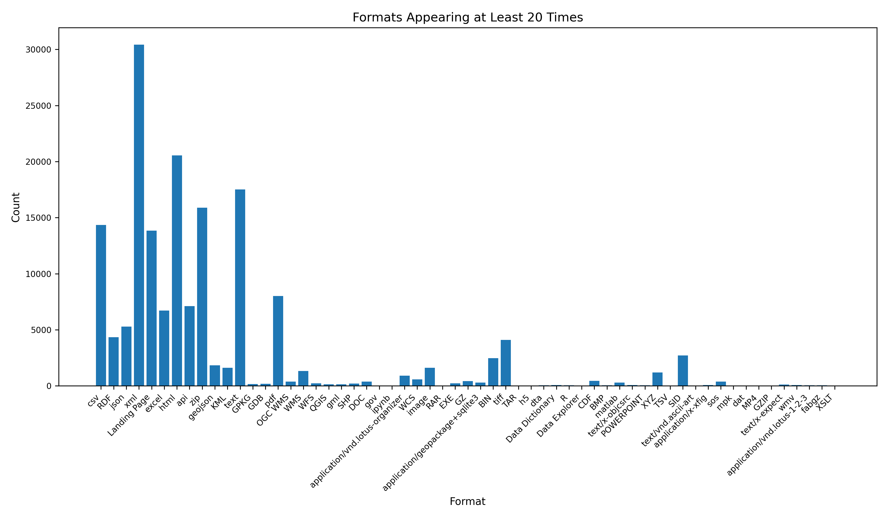

# Running the Scraper
For mac os, run with caffeinate to keep machine on
```bash
caffeinate -dims uv run main2.py
```

# Scraper Details
- Each page on (`https://catalog.data.gov/dataset?page={page_number}`)[https://catalog.data.gov/dataset?page=1000] displays at most 20 dataset links. For each page, **WebDriverWait** was called until the presence of CSS selector `"h3.dataset-heading a"` was detected. Then all of those links were scraped.
- After collecting all the links on a page, the ,at most, 20 links were scraped in 4 batches for the attributes in the table below. The links were navigated to using `driver.get()`. If scraping failed, the link would be retried up to three times before the scraper moved on to the next page of datasets. 
- The scraper would eventually stop when 5 empty pages were found in a row, but this was not reached in the time constraint. (it takes multiple hours to scrape 1000 pages)

## Field Extraction Details

| Field             | Attribute Type | Attribute Value                                                      |
|-------------------|-----------------|----------------------------------------------------------------------|
| title             | CSS Selector     | `h1[itemprop='name']`                                                  |
| organization_type | CSS Selector     | `span.organization-type`                                              |
| formats           | CSS Selector     | `section#dataset-resources span.format-label`                         |
| tags              | CSS Selector     | `ul.tag-list li a`                                                     |
| publisher_heading | CSS Selector     | `section#organization-info h1.heading`                                |
| publisher         | CSS Selector     | `[title='publisher']`                                                  |
| ~date_created~    | ~CSS Selector~   | ~`span[itemprop='dateModified'] a`~                                    |
| date_last_updated | XPath            | `//th[normalize-space(text())='{label_text}']/following-sibling::td`   |
 
XPath was necessary for `date_last_updated` because this field appeared inside an **HTML table**. The label (e.g., "Metadata Date") and its corresponding value were separated into different `<td>` cells. XPath allows for matching the label text first and then selecting the adjacent value, something CSS selectors alone can't do easily.

# Data Scraping and Cleaning Notes
- Scraped **2,052** pages out of approximately **15,000** pages.
- Collected **43,318 datasets**.
- Out of the **43,318** datasets scraped, **16 datasets had no title**.
  - For **15/16**, this is likely due to poor scraping in previous runs that were cached (datasets were checked only if their URL existed in the CSV).
  - **1 dataset** with no title but with other fields populated was from the EPA:  
    [EPA dataset with no title](https://catalog.data.gov/dataset/none-3b132).

- All datasets without titles were dropped because the **title field was required** to be non-nullable.

- **3 datasets had null dates** These were also dropped.
  - Possible cause: script was manually canceled during writing, even though the fields were populated on the website.
  
- **Mistake with date_created**:
  - It was incorrectly scraped from the `dateModified` field via CSS, which essentially gave the same value as date_last_updated.
  - A slightly more correct approach would have been to use **XPath** targeting either the "Metadata Date" or "Reference Date(s)" fields, but this would only show when the dataset was digitized. There are a number of datasets from the 60s and 70s, but it is rather difficult to find the original publishing date of the dataset from the government dataset page alone. (Would need to go down to the `Additional Metadata` table, click `show more` and then hope published is there (it is typically not referenced by the same field, or even present) 

- **Formats and Tags cleaning**:
  - The unique values found in the formats make it clear that there is no constraint on what the values of formats can be, [see format_counts.json](format_counts.json). This is after normalizing some of the formats, but there are just too many. Some of my favorites are when they just describe the data instead of the format:
  - `"Acronyms CCA Community choice aggregation MWh Megawatt hour PPA Power purchase agreement RECs Renewable energy certificate": 1,`
  - `"21 column data: Measured data with 95 % error bars given in first 10 columns (including three measurement types), Exponential Fits with 95% confidence bounds given in next 10 columns, and 3 dB point used to define bandwidth of each measurement given in the last column": 1,`
 
  - Tags were normalized (standardizing slashes with spaces and splitting hyphens into spaces), to allow for ILIKE partial matches later.
  - [Unique tag counts](tag_counts.json)
    
# Figures!
Some fun figures visualizing the distribution of dataset publishers. Federal takes up the most space, but many federal datasets focus on smaller parts of the country, so these figures do not insinuate that we have many country wide datasets. In these scraped datasets, NOAA is the largest publisher, but this does not reflect the governments data actions as a whole since only about 13% of the datasets have been scraped (~43k/~317k). 

### All Publishers: [fig/All_Publishers.png](fig/All_Publishers.png)


### All Except Federal Publishers: [fig/All_Except_Federal_Publishers.png](fig/All_Except_Federal_Publishers.png)


### Publishers with Count ≥ 50: [fig/Publishers_with_Count_>_50.png](fig/Publishers_with_Count_>_50.png)


### Publishers with Count ≤ 50: [fig/Publishers_with_Count_≤_50.png](fig/Publishers_with_Count_≤_50.png)


### Format Counts: [format_counts.png](format_counts.png)



# Query Summary

The [queries](queries.py) ran on the scraped dataset mainly explore dataset tags, formats, and publishers. The most technically interesting queries involve the **use of PostgreSQL array unnesting and `ILIKE`-based partial matching**, especially for querying dataset tags. Note that unnesting the tags and searching through them is super slow, so a better way to do this is to make a tag lookup table. 

Outputs of the queries can be found in [queries.md](queries.md) 

## Tags (Exact Match)

The `search_datasets_by_tag` function performs an **exact match** against tags using PostgreSQL's `ANY` operator combined with `ILIKE`. 

## Tags (Partial Match)

The `search_datasets_by_partial_tag` function is more flexible and powerful. It:
- Unnests the `tags` array.
- Applies `ILIKE` on each tag for **partial matching** (e.g., `'horse'` matches `'horsepower'`, `'horses'`, etc.).
- Wraps this logic inside a subquery using `EXISTS`, which allows filtering datasets where **any** tag contains the given substring.


## Combined Search (Title or Tag)

The `search_datasets` function combines both:
- Partial matching in the `title` using `ILIKE`.
- Partial matching in the `tags` using the same unnest/EXISTS strategy.

## Random Dataset

But my favorite query is just getting a random dataset, because you can find a lot of interesting datasets that way.
- [Chicago Public Schools - Middle School Attendance Boundaries SY2324](https://catalog.data.gov/dataset/chicago-public-schools-middle-school-attendance-boundaries-sy2324)
- [USDA Rural Development Resale Properties - Real Estate Owned](https://catalog.data.gov/dataset/usda-rural-development-resale-properties-real-estate-owned)
- [Sediment macrofaunal composition and sediment geochemistry of deep-sea coral habitats after the Deepwater Horizon oil spill in the Gulf of Mexico, 2010-2016](https://catalog.data.gov/dataset/sediment-macrofaunal-composition-and-sediment-geochemistry-of-deep-sea-coral-habitats-2010)
- [HAQR Priority Green Infrastructure Zones](https://catalog.data.gov/dataset/haqr-priority-green-infrastructure-zones)
- [Effects of Child Maltreatment, Cumulative Victimization Experiences, and Proximal Life Stress on Adult Outcomes of Substance Use, Mental Health Problems, and Antisocial Behavior, 2 Pennsylvania counties, 1976-2010](https://catalog.data.gov/dataset/effects-of-child-maltreatment-cumulative-victimization-experiences-and-proximal-life-1976--b842f)
- [Bridge Areas (USACE IENC)](https://catalog.data.gov/dataset/bridge-areas-usace-ienc)


## Other Queries

Other queries include:
- Aggregating formats used fewer than N times.
- Getting the top tags using `GROUP BY` and `COUNT`.


