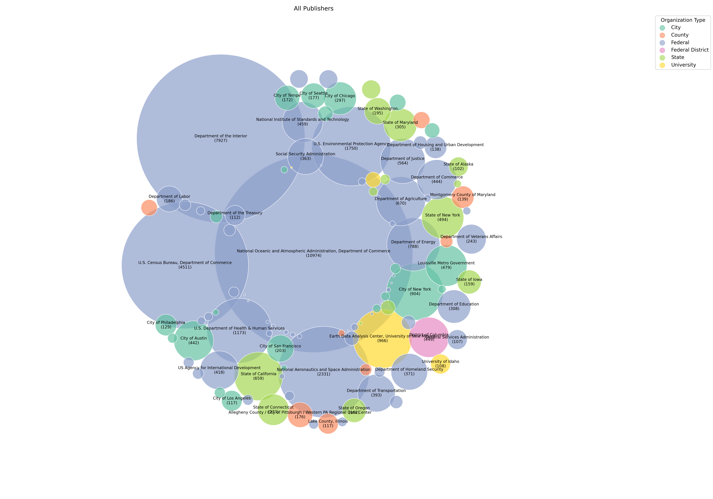
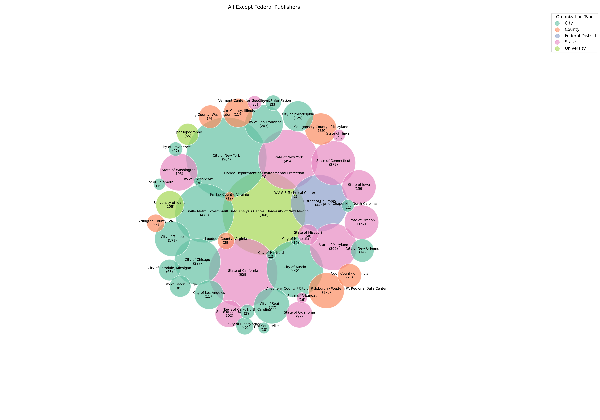
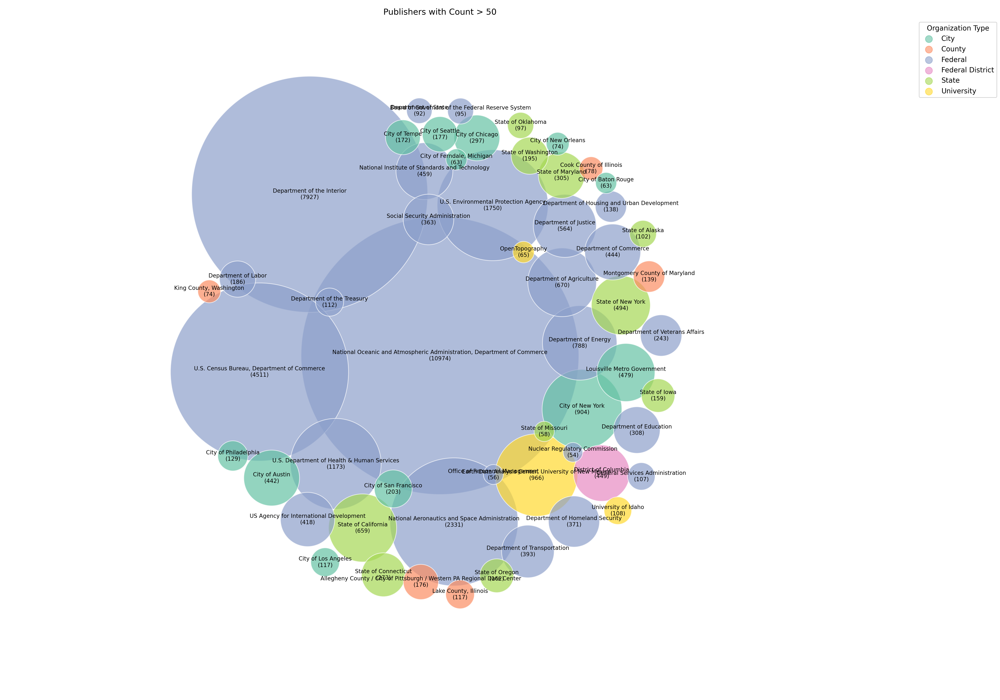
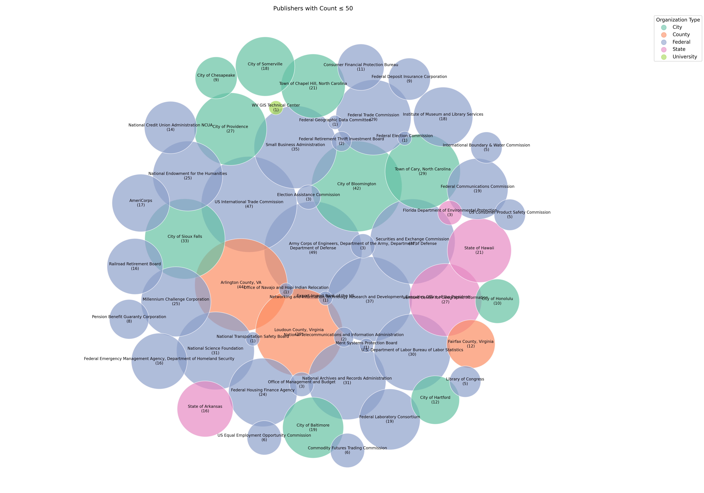

# Running the Scraper
For mac os, run with caffeinate to keep machine on
```bash
caffeinate -dims uv run main2.py
```

# Scraper Details
- Each page on (`https://catalog.data.gov/dataset?page={page_number}`)[https://catalog.data.gov/dataset?page=1000] displays at most 20 dataset links. For each page, **WebDriverWait** was called until the presence of CSS selector `"h3.dataset-heading a"` was detected. Then all of those links were scraped.
- After collecting all the links on a page, the ,at most, 20 links were scraped in 4 batches for the attributes in the table below. The links were navigated to using `driver.get()`. If scraping failed, the link would be retried up to three times before the scraper moved on to the next page of datasets. 
- The scraper would eventually stop when 5 empty pages were found in a row, but this was not reached in the time constraint. (it takes multiple hours to scrape 1000 pages)

## Field Extraction Details

| Field             | Attribute Type | Attribute Value                                                      |
|-------------------|-----------------|----------------------------------------------------------------------|
| title             | CSS Selector     | `h1[itemprop='name']`                                                  |
| organization_type | CSS Selector     | `span.organization-type`                                              |
| formats           | CSS Selector     | `section#dataset-resources span.format-label`                         |
| tags              | CSS Selector     | `ul.tag-list li a`                                                     |
| publisher_heading | CSS Selector     | `section#organization-info h1.heading`                                |
| publisher         | CSS Selector     | `[title='publisher']`                                                  |
| ~date_created~    | ~CSS Selector~   | ~`span[itemprop='dateModified'] a`~                                    |
| date_last_updated | XPath            | `//th[normalize-space(text())='{label_text}']/following-sibling::td`   |

**Note**:  
XPath was necessary for `date_last_updated` because this field appeared inside an **HTML table**. The label (e.g., "Metadata Date") and its corresponding value were separated into different `<td>` cells. XPath allowed matching the label text first and then selecting the adjacent value, something CSS selectors alone can't do easily.

# Data Scraping and Cleaning Notes
- Scraped **2,052** pages out of approximately **15,000** pages.
- Collected **43,318 datasets**.
- Out of the **43,318** datasets scraped, **16 datasets had no title**.
  - For **15/16**, this is likely due to poor scraping in previous runs that were cached (datasets were checked only if their URL existed in the CSV).
  - **1 dataset** with no title but with other fields populated was from the EPA:  
    [EPA dataset with no title](https://catalog.data.gov/dataset/none-3b132).

- All datasets without titles were dropped because the **title field was required** to be non-nullable.

- **3 datasets had null dates**.
  - Possible cause: script was manually canceled during writing, even though the fields were populated on the website.
  
- **Mistake with date_created**:
  - It was incorrectly scraped from the `dateModified` field via CSS.
  - Correct approach would have been to use **XPath** targeting either the "Metadata Date" or "Reference Date(s)" fields.
  - These fields were inconsistent across datasets, making initial publish dates hard to reliably extract.

# Figures

### All Publishers


### All Except Federal Publishers


### Publishers with Count ≥ 50


### Publishers with Count ≤ 50


### Format Counts


# Query Summary

The SQLAlchemy queries in this project focus on exploring patterns in dataset tags, formats, and publishers. The most notable and technically interesting components involve the **use of PostgreSQL array unnesting and `ILIKE`-based partial matching**, especially for querying dataset tags.

## Tags (Exact Match)

The `search_datasets_by_tag` function performs an **exact match** against tags using PostgreSQL's `ANY` operator combined with `ILIKE`. This is efficient for finding datasets where one of the tags exactly matches a search term, regardless of case.

## Tags (Partial Match)

The `search_datasets_by_partial_tag` function is more flexible and powerful. It:
- Unnests the `tags` array using `func.unnest`.
- Applies `ILIKE` on each tag for **partial matching** (e.g., `'horse'` matches `'horsepower'`, `'horses'`, etc.).
- Wraps this logic inside a subquery using `EXISTS`, which allows filtering datasets where **any** tag contains the given substring.

This approach mimics the SQL:

```sql
SELECT * FROM datasets
WHERE EXISTS (
  SELECT 1 FROM unnest(tags) AS tag WHERE tag ILIKE '%horse%'
)
```

and is implemented directly in SQLAlchemy for full ORM integration.

## Combined Search (Title or Tag)

The `search_datasets` function combines both:
- Partial matching in the `title` using `ILIKE`.
- Partial matching in the `tags` using the same unnest/EXISTS strategy.

This allows broader search functionality and is useful for flexible dataset discovery interfaces.

## Other Queries

Other queries include:
- Getting a random dataset.
- Aggregating formats used fewer than N times.
- Getting datasets by format with partial string matching (`ILIKE`).
- Getting the top tags using `GROUP BY` and `COUNT`.

These support exploratory analysis and tagging statistics.


